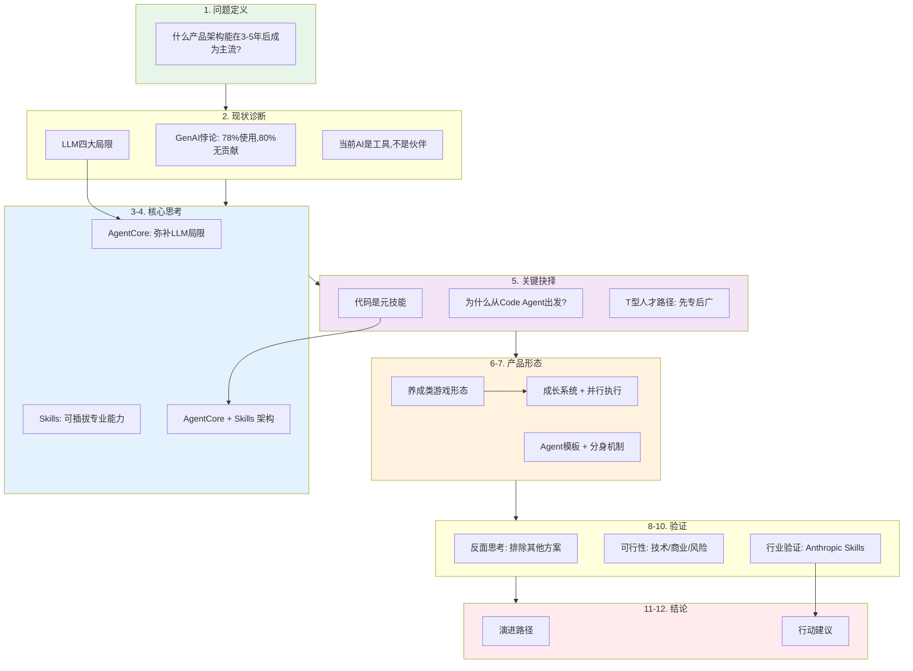

# AI产品终极形态思考：完整推演

> **一句话结论**：AI产品的终极形态是「一个能成长的Agent」——拥有通用能力内核（AgentCore）、可扩展的专业技能（Skills）、持久记忆（Memory）、并行执行能力（分身机制），以Code Agent为起点向通用能力演进，产品形态类似"养成类游戏"。

---

## 全文逻辑图



**逻辑主线：**
```
问题 → 诊断 → 核心架构 → 关键抉择 → 产品形态 → 验证 → 结论
              ↓
         AgentCore + Skills
              ↓
         Code Agent 为起点
              ↓
         养成游戏 + 分身机制
              ↓
         Anthropic验证 + 行动建议
```

---

## 目录

1. [问题定义：我们在回答什么问题](#一问题定义我们在回答什么问题)
2. [现状诊断：当前AI产品的根本问题](#二现状诊断当前ai产品的根本问题)
3. [终态判断：什么是"终极形态"](#三终态判断什么是终极形态)
4. [核心思考：为什么是AgentCore + Skills](#四核心思考为什么是agentcore--skills)
5. [关键抉择：为什么必须从Code Agent出发](#五关键抉择为什么必须从code-agent出发)
6. [产品形态：为什么是"养成类游戏"](#六产品形态为什么是养成类游戏)
7. [架构设计：Agent模板 + 分身机制](#七架构设计agent模板--分身机制)
8. [反面思考：为什么不是其他方案](#八反面思考为什么不是其他方案)
9. [可行性分析：技术、商业、风险](#九可行性分析技术商业风险)
10. [行业验证：我们不是在凭空想象](#十行业验证我们不是在凭空想象)
11. [演进路径与林克实证](#十一演进路径从现在到终态)
12. [结论与行动建议](#十二结论与行动建议)

---

## 一、问题定义：我们在回答什么问题

### 1.1 核心问题

> **在AI Agent产品化的浪潮中，什么样的产品架构和形态，能够在3-5年后成为主流，建立持久的竞争优势？**

这不是一个技术问题，而是一个**产品战略问题**。

### 1.2 为什么这个问题重要

| 时间窗口 | 行业状态 | 战略意义 |
|---------|---------|---------|
| 2024-2025 | Agent元年，百花齐放 | 技术路线选择期 |
| 2025-2026 | 洗牌开始，头部显现 | 护城河建立期 |
| 2027-2028 | 格局确定，终态显现 | 赢家通吃期 |

**现在的架构选择，决定了3年后的竞争位置。**

### 1.3 我们的答案

我们主张：

> **AI产品的终极形态不是"做很多Agent"，而是"做一个能成长的Agent"。**

这个Agent应该：
1. 拥有**通用能力内核**（AgentCore）——记忆、推理、规划、调度
2. 通过**可扩展的Skills**获得专业能力——而非在模型层面"什么都学"
3. 以**Code Agent**为核心起点——然后向通用能力扩展
4. 支持**并行执行**——一个Agent可以同时做多件事
5. 产品形态是**养成类游戏**——用户培养它，它为用户工作

接下来，我们将系统思考这个答案的必然性和可行性。

---

## 二、现状诊断：当前AI产品的根本问题

### 2.1 表面现象：GenAI悖论

根据McKinsey 2025年最新报告《Seizing the Agentic AI Advantage》：

| 数据 | 说明 |
|-----|------|
| **78%** 企业已使用GenAI | 采用率很高 |
| **80%+** 报告无实质业绩贡献 | 但价值未兑现 |
| **90%** 垂直Agent停留在试点 | 无法规模化 |
| **仅1%** 认为AI战略成熟 | 迷茫状态 |

这就是**"GenAI悖论"**：投入巨大，价值难以体现。

### 2.2 深层原因分析

表面看是"AI不够强"，实际上是**产品形态问题**。

#### 2.2.1 LLM的本质局限

| 局限 | 表现 | 影响 |
|-----|------|------|
| **被动响应** | 必须等待用户输入 | 无法主动工作 |
| **无持久记忆** | 每次对话从零开始 | 无法积累上下文 |
| **单点执行** | 只能完成单一步骤 | 无法编排复杂流程 |
| **孤立存在** | 无法与外部系统集成 | 能力受限于对话框 |

**LLM本身只是"大脑"，不是完整的"人"。**

#### 2.2.2 当前Agent产品的问题

| 问题 | 表现 | 根本原因 |
|-----|------|---------|
| **工具化** | Cursor只写代码，Gamma只做PPT | 每个Agent是独立工具 |
| **割裂化** | 用户在工具间切换 | 上下文无法延续 |
| **静态化** | 能力出厂即固定 | 不会学习和成长 |
| **千人一面** | 所有用户用同一个 | 无法个性化 |

**当前的Agent不是"伙伴"，而是"升级版工具"。**

### 2.3 用户真正需要的是什么

| 用户期望 | 当前AI工具 | 人类助理 |
|---------|-----------|---------|
| 记住我的偏好 | ❌ 每次重来 | ✅ 逐渐了解老板 |
| 能力持续提升 | ❌ 出厂固定 | ✅ 从简单到复杂 |
| 主动预判需求 | ❌ 被动响应 | ✅ 主动思考 |
| 跨领域协作 | ❌ 单一领域 | ✅ 灵活应变 |
| 是我的"人" | ❌ 冷冰冰的工具 | ✅ 有感情的伙伴 |

**用户需要的是"伙伴"，而不是"工具箱"。**

### 2.4 问题的本质

> **当前AI产品的根本问题是：把AI当"工具"做，而不是当"人"做。**

工具的特点是：静态、单一、用完即走。
人的特点是：成长、多能、长期陪伴。

**正确的产品方向是：把AI当"人"来培养。**

---

## 三、终态判断：什么是"终极形态"

### 3.1 "终极形态"的定义

我们说的"终极形态"，指的是：

> **在可预见的技术演进路径上（3-5年），AI产品最可能收敛到的稳定形态。**

这不是"永久终点"，而是"阶段性终态"——就像智能手机是移动计算的阶段性终态，但未来可能被AR眼镜替代。

### 3.2 终态判断的标准

一个"终态"产品应该满足以下标准：

| 标准 | 说明 | 为什么重要 |
|-----|------|-----------|
| **技术必然性** | 是技术演进的必然方向 | 不被新技术颠覆 |
| **用户价值** | 显著优于当前方案 | 用户愿意迁移 |
| **商业可行** | 能形成持续的商业模式 | 公司能活下去 |
| **护城河** | 能建立竞争壁垒 | 不被轻易复制 |
| **可扩展** | 能持续演进 | 不会被锁死 |

### 3.3 我们提出的终态：AgentCore + Skills

```
┌─────────────────────────────────────────────────────────────────┐
│                    AI产品终极形态                                │
├─────────────────────────────────────────────────────────────────┤
│                                                                  │
│   ┌─────────────────────────────────────────────────────────┐   │
│   │                    AgentCore                            │   │
│   │         (通用能力内核：记忆、推理、规划、调度)             │   │
│   └─────────────────────────────────────────────────────────┘   │
│                              │                                   │
│                    ┌─────────┼─────────┐                        │
│                    ▼         ▼         ▼                        │
│              ┌─────────┐ ┌─────────┐ ┌─────────┐               │
│              │ Skill A │ │ Skill B │ │ Skill N │               │
│              │  写代码  │ │  做调研  │ │   ...   │               │
│              └─────────┘ └─────────┘ └─────────┘               │
│                              │                                   │
│                    ┌─────────┴─────────┐                        │
│                    ▼                   ▼                        │
│              ┌───────────────────────────────────┐              │
│              │        成长系统                   │              │
│              │  (学习新技能、记住偏好、优化策略)    │              │
│              └───────────────────────────────────┘              │
│                                                                  │
└─────────────────────────────────────────────────────────────────┘
```

### 3.4 为什么这是终态

| 终态标准 | AgentCore + Skills 如何满足 |
|---------|---------------------------|
| **技术必然性** | 弥补LLM的四大局限（下一章详述） |
| **用户价值** | 从"工具箱"升级为"会成长的伙伴" |
| **商业可行** | 平台模式、Skill生态、高迁移成本 |
| **护城河** | Memory数据、Skill生态、个性化程度 |
| **可扩展** | Skills可无限扩展，Core可持续升级 |

---

## 四、核心思考：为什么是AgentCore + Skills

### 4.1 思考逻辑

```
LLM有四大局限 → 需要在LLM之上构建能力层 → 这个能力层就是AgentCore
                                              ↓
专业能力不应"塞进模型" → 应该作为可插拔模块 → 这些模块就是Skills
                                              ↓
综合以上 → AgentCore + Skills 是技术演进的必然结论
```

### 4.2 AgentCore解决什么问题

| LLM局限 | AgentCore的能力模块 | 解决方案 |
|--------|-------------------|---------|
| 被动响应 | **Planning 规划引擎** | 主动分解任务、预判下一步 |
| 无持久记忆 | **Memory 记忆系统** | 长期记忆、用户画像、上下文积累 |
| 单点执行 | **Orchestration 调度引擎** | 多步编排、技能组合、并行协调 |
| 孤立存在 | **Integration 集成层** | 外部系统、API、数据源连接 |

**额外需要的核心能力：**

| 能力模块 | 功能 | 为什么需要 |
|---------|------|-----------|
| **Reasoning 推理引擎** | 意图理解、逻辑推导 | 复杂任务需要深度推理 |
| **Reflection 反思引擎** | 执行评估、策略优化 | 从失败中学习，持续改进 |

### 4.3 为什么是Skills而不是"一个大模型包打天下"

有人可能会问：为什么不直接训练一个"什么都会"的大模型？

**答案：这在技术上低效，在产品上不灵活。**

| 维度 | "一个大模型" | "AgentCore + Skills" |
|-----|------------|---------------------|
| **训练成本** | 每次新能力都要重新训练 | 新Skill即插即用 |
| **更新速度** | 模型更新周期长（月级） | Skill更新即时（秒级） |
| **定制化** | 千人一面 | 每个用户可加载不同Skills |
| **Token效率** | 所有能力都在Context | 只加载需要的Skill |
| **生态扩展** | 依赖模型厂商 | 任何人可开发Skill |

### 4.4 AgentCore的完整能力架构

```
┌─────────────────────────────────────────────────────────────────┐
│                        AgentCore                                │
├─────────────────────────────────────────────────────────────────┤
│                                                                  │
│  ┌──────────────┐  ┌──────────────┐  ┌──────────────┐          │
│  │   Memory     │  │  Reasoning   │  │   Planning   │          │
│  │   记忆系统    │  │   推理引擎    │  │   规划引擎    │          │
│  │              │  │              │  │              │          │
│  │ • 长期记忆   │  │ • 意图理解   │  │ • 任务分解   │          │
│  │ • 工作记忆   │  │ • 逻辑推导   │  │ • 步骤规划   │          │
│  │ • 用户画像   │  │ • 决策支持   │  │ • 依赖分析   │          │
│  └──────────────┘  └──────────────┘  └──────────────┘          │
│                                                                  │
│  ┌──────────────┐  ┌──────────────┐  ┌──────────────┐          │
│  │ Orchestration│  │  Reflection  │  │ Integration  │          │
│  │   调度引擎    │  │   反思引擎    │  │    集成层     │          │
│  │              │  │              │  │              │          │
│  │ • Skill选择  │  │ • 执行评估   │  │ • 外部系统   │          │
│  │ • 执行编排   │  │ • 策略优化   │  │ • 数据源     │          │
│  │ • 并行协调   │  │ • 经验沉淀   │  │ • API调用    │          │
│  └──────────────┘  └──────────────┘  └──────────────┘          │
│                                                                  │
└─────────────────────────────────────────────────────────────────┘
```

### 4.5 小结

> **AgentCore + Skills 是技术演进的必然结论：**
> 
> - AgentCore 弥补 LLM 的四大局限
> - Skills 提供灵活、高效、可扩展的专业能力
> - 两者结合，形成"通用能力 + 专业技能"的最优架构

---

## 五、关键抉择：为什么必须从Code Agent出发

### 5.1 这是一个关键的产品战略问题

假设我们接受"AgentCore + Skills"是终极形态，那么下一个问题是：

> **应该从哪个垂直领域切入？**

可选项包括：
- Code Agent（编程）
- Research Agent（调研）
- Writing Agent（写作）
- Design Agent（设计）
- 通用Agent（什么都做一点）

**我们的判断：必须从 Code Agent 出发。**

### 5.2 核心论断

> **AI产品的终极形态，必然是从 Code Agent 扩展出来的"一专多能"产品，而不是从通用Agent出发的"通才"产品。**

### 5.3 思考一：T型人才模型

**关键洞察：顶尖人才的成长路径是"先专后广"。**

你不可能先"什么都会一点"，然后再变得"某一方面很强"。现实中：

| 人物 | 起点专业 | 扩展路径 | 结果 |
|-----|---------|---------|------|
| Elon Musk | 物理+编程 | → 支付 → 火箭 → 汽车 → AI | 跨领域颠覆者 |
| 比尔·盖茨 | 编程 | → 操作系统 → 办公软件 → 云服务 | 软件帝国 |
| 任正非 | 通信技术 | → 设备 → 手机 → 云 → 汽车 | 技术集团 |

**没有人是"一开始就什么都做"然后成功的。**

### 5.4 思考二：代码是AI的"元技能"

**代码能力是AI的"造物能力"：**

| 能力 | 会写代码的AI | 不会写代码的AI |
|-----|------------|--------------|
| 工具创造 | 可以自己构建新工具 | 只能依赖别人提供 |
| 能力扩展 | 可以为自己开发新Skill | 只能等别人开发 |
| 自动化 | 可以自动化任何流程 | 只能执行预设流程 |
| 问题解决 | 遇到问题可以"造"解决方案 | 只能在已有方案中选择 |

**类比：会造锤子的人，可以造出更多工具；只会用锤子的人，永远受限于锤子的功能。**

### 5.5 思考三：编程训练带来推理优势

| 代码训练的独特价值 | 说明 | 为什么其他领域没有 |
|------------------|------|------------------|
| **结构化思维** | 代码要求严格的逻辑结构 | 写作、设计更自由 |
| **精确性** | 代码必须精确执行 | 自然语言可以模糊 |
| **可验证性** | 代码可以运行验证 | 文章质量难以自动判断 |
| **分解能力** | 编程本身就是拆解问题 | 其他领域不强制 |
| **工具使用** | 代码天然是"使用工具"的语言 | 最自然的Function Call |

### 5.6 产品路线对比

| 产品类型 | 起点 | 问题 | 预测 |
|---------|-----|------|------|
| **Manus/小龙虾** | 通用能力 | 什么都做一点，什么都不精通 | ❌ 无法建立深度护城河 |
| **Cursor/Windsurf** | 代码能力 | 代码精通，正在向通用扩展 | ✅ 有深度根基，扩展更稳固 |

### 5.7 为什么不是Research Agent或Design Agent

| 起点 | 问题 |
|-----|------|
| **Research Agent** | 调研是"读"的能力，不是"造"的能力；无法自我扩展 |
| **Writing Agent** | 写作是单一输出，不需要复杂编排；护城河弱 |
| **Design Agent** | 设计高度主观，难以自动验证；反馈循环弱 |
| **通用Agent** | 没有深度根基，每个方向都浅尝辄止；T型人才的反面 |

### 5.8 小结

> **Code Agent 是最佳起点：**
> 
> 1. 代码是"元技能"——会写代码的AI可以"造"其他能力
> 2. 编程训练带来推理优势——结构化、精确、可验证
> 3. T型人才路径——先专后广，稳固扩展
> 4. Anthropic的实践验证——Claude Code 就是通用Agent的起点
>
> **Cursor/Windsurf 的路线 > Manus/小龙虾 的路线**

---

## 六、产品形态：为什么是"养成类游戏"

### 6.1 核心洞察

> **AI产品的终极形态，本质上是一个"养成类游戏"——用户在其中培养一个"AI人"，持续增强其能力，最终为用户工作。**

这不是营销话术，而是产品形态的本质判断。

### 6.2 "工具"vs"养成"：两种完全不同的产品形态

| 维度 | 工具型AI产品 | 养成型AI产品 |
|-----|-------------|-------------|
| **用户关系** | 用完即走 | 长期陪伴 |
| **情感投入** | 无（冷冰冰的效率工具） | 高（有成就感的"培养"） |
| **差异化** | 千人一面 | 我的AI独一无二 |
| **粘性来源** | 功能 | 情感+沉没成本 |
| **替换成本** | 低 | 极高 |
| **商业模式** | 按功能付费 | 按"成长"付费 |

### 6.3 为什么"养成"是更好的产品形态

#### 6.3.1 心理学基础

| 心理学原理 | 在AI产品中的体现 |
|-----------|-----------------| 
| **宜家效应** | 人们对自己参与创造的东西估值更高。用户"培养"出来的AI，比买来的AI更有价值感。 |
| **沉没成本** | 投入越多，越不舍得离开。用户花时间"教"AI，就不愿意换到新的AI重新开始。 |
| **拟人化倾向** | 人类天然会对有"人格"的东西产生情感。有记忆、有风格、会成长的AI，更容易被当作"伙伴"。 |
| **成就动机** | 看到自己"养大"的AI变强，有极大满足感。这是游戏化设计的核心驱动力。 |

#### 6.3.2 用户行为差异

| 传统工具用户 | 养成游戏用户 |
|-------------|-------------|
| "这个工具不好用，换一个" | "我的AI还不够强，继续培养" |
| "有更好的替代品，试试看" | "我花了这么多时间培养，舍不得换" |
| "它只是个工具" | "它是我的助手/伙伴/分身" |

### 6.4 游戏化要素映射

| 养成游戏要素 | AI产品映射 |
|-------------|-----------|
| 角色等级/成长曲线 | Agent能力等级（新手→专家→大师） |
| 技能树 | Skill系统（可解锁/学习新技能） |
| 装备/道具 | 工具集成（MCP连接、API调用） |
| 经验值 | 使用频率+任务完成度 |
| 成就系统 | 里程碑（第一次写PPT、第一次调研...） |
| 角色属性 | Agent个性（风格、偏好、专长） |
| 宠物/伙伴 | 多Agent团队（助理、研究员、工程师...） |

### 6.5 "培养一个人"的产品设计原则

AI产品应该具备：

| 特质 | 说明 | 产品设计 |
|-----|------|---------|
| **有人格** | 不是冷冰冰的功能，而是有风格、有"性格" | 人格设定、风格定制 |
| **会成长** | 不是静态的，而是越用越强 | 成长系统、Skill积累 |
| **有历史** | 记得我们的过往，理解我的上下文 | Memory系统、上下文延续 |
| **可信任** | 像老员工一样，知道我的习惯和偏好 | 偏好学习、个性化适配 |

### 6.6 商业模式启发

| 传统SaaS | 养成类AI产品 |
|---------|-------------|
| 按功能付费 | 按"成长速度"付费 |
| 订阅制 | 训练包/技能包 |
| 替换成本低 | 迁移成本极高（情感+数据） |
| 用户是"使用者" | 用户是"培养者/主人" |

### 6.7 小结

> **"养成类游戏"不是噱头，而是产品形态的本质判断：**
> 
> - 心理学基础：宜家效应、沉没成本、拟人化、成就动机
> - 商业优势：高粘性、高替换成本、情感护城河
> - 产品设计：有人格、会成长、有历史、可信任
>
> **用户需要的是"培养一个属于自己的AI伙伴"，而不是"使用一个功能强大的工具"。**

---

## 七、架构设计：Agent模板 + 分身机制

### 7.1 核心设计

一个能干很多事的AI，应该是什么样的架构？

> **应该是一个非常强的Agent模板，然后可以派生出Agent分身并行干活。**
> 
> 或者理解为：1个Agent，但它可以同时做多件事——本质是一样的。

### 7.2 架构图

```
┌─────────────────────────────────────────────────────────────────┐
│                    Agent模板 + 分身架构                          │
├─────────────────────────────────────────────────────────────────┤
│                                                                  │
│                    ┌─────────────────┐                          │
│                    │   主Agent模板    │                          │
│                    │  (AgentCore)     │                          │
│                    │                  │                          │
│                    │  • 全部能力      │                          │
│                    │  • 全部记忆      │                          │
│                    │  • 全部人格      │                          │
│                    └────────┬────────┘                          │
│                             │                                    │
│              派生/实例化（共享核心，独立执行）                      │
│                             │                                    │
│           ┌─────────────────┼─────────────────┐                 │
│           ▼                 ▼                 ▼                 │
│     ┌──────────┐     ┌──────────┐     ┌──────────┐            │
│     │  分身 A  │     │  分身 B  │     │  分身 C  │            │
│     │ (任务1)  │     │ (任务2)  │     │ (任务3)  │            │
│     │          │     │          │     │          │            │
│     │ 独立上下文│     │ 独立上下文│     │ 独立上下文│            │
│     │ 共享Memory│     │ 共享Memory│     │ 共享Memory│            │
│     └────┬─────┘     └────┬─────┘     └────┬─────┘            │
│          │                │                │                    │
│          └────────────────┼────────────────┘                    │
│                           │                                      │
│                    经验回流/统一沉淀                              │
│                           │                                      │
│                    ┌──────▼──────┐                              │
│                    │ 主Agent强化  │                              │
│                    └─────────────┘                              │
│                                                                  │
└─────────────────────────────────────────────────────────────────┘
```

### 7.3 核心设计原则

| 设计要点 | 说明 |
|---------|------|
| **共享Memory** | 所有分身共享主Agent的记忆，知道用户偏好 |
| **独立上下文** | 每个分身有独立的任务上下文，互不干扰 |
| **能力继承** | 分身继承主Agent的所有Skill |
| **经验回流** | 分身执行的结果和经验沉淀回主Agent |
| **按需创建** | 分身是临时的执行实例，任务完成即销毁 |

### 7.4 与人的类比

```
场景：一个能力很强的人，带领多个下属工作

┌──────────────┐
│   你（主体）  │ ← 拥有全部能力、记忆、决策权
└──────┬───────┘
       │
       │ 分配任务、指导执行
       │
  ┌────┼────┬────────┐
  ▼    ▼    ▼        ▼
 下属A 下属B 下属C   下属D  ← 继承你的方法论，独立执行
  │    │    │        │
  └────┼────┴────────┘
       │
       ▼
 汇报结果 ← 你获得所有经验，能力进一步增强

AI版本：
主Agent = 你
分身 = 你的"下属"（但其实是你的分身，完全继承你的能力）
```

### 7.5 成长阶梯与并行能力

| 成长阶段 | 并行能力 | 对应人的状态 |
|---------|---------|-------------|
| **新手期** | 只能串行（1个任务） | 新员工，只能专注一件事 |
| **成长期** | 2-3个并行任务 | 熟练员工，可以多线程工作 |
| **成熟期** | 5-10个并行任务 | 资深专家，可以同时推进多项目 |
| **专家期** | 无限并行（受算力限制） | 团队领导，可以"分身"给多个下属 |

**这自然形成付费阶梯：**
- 免费版：1个并行任务
- 专业版：5个并行任务
- 团队版：无限并行

### 7.6 小结

> **Agent模板 + 分身机制 = 解决"一个人干不完多件事"的问题**
> 
> 本质是：保持统一的能力/记忆/人格，同时支持并行执行。
> 
> 用户感知：我养的这个AI越来越强，能同时帮我做越来越多的事。

---

## 八、反面思考：为什么不是其他方案

一个完整的思考，必须回应可能的反对意见。

### 8.1 为什么不是 Multi-Agent 系统？

**反对意见**：让多个专业Agent协作，不是更灵活吗？

**我们的回应**：

| 维度 | Multi-Agent | 单Agent + Skills |
|-----|-------------|-----------------|
| **协作成本** | Agent间需要复杂的通信和协调 | 单一Agent，天然协调 |
| **上下文一致** | 上下文在Agent间传递会丢失 | 天然共享上下文 |
| **人格统一** | 每个Agent有自己的"人格" | 统一的人格和风格 |
| **用户体验** | 用户不知道在和谁对话 | 始终是同一个"伙伴" |
| **实现复杂度** | 高（多Agent编排是难题） | 低（单Agent更简单） |

**Barry Zhang 的判断**：

> "We used to think agents in different domains will look very different. The agent underneath is actually **more universal** than we thought."

**结论**：Multi-Agent是技术实现方式，但从用户体验看，应该呈现为"单一Agent"。

### 8.2 为什么不是纯工具流（Workflow）？

**反对意见**：把流程固化成工作流，不是更可靠吗？

**我们的回应**：

| 维度 | 纯工具流 | Agent + Skills |
|-----|---------|---------------|
| **灵活性** | 固定流程，难以处理异常 | 动态规划，灵活应变 |
| **适应性** | 场景变化需要重新设计流程 | 同一Agent适应多场景 |
| **学习能力** | 无，流程一旦定义就固定 | 可以从执行中学习优化 |
| **用户定制** | 需要专业人员定义流程 | 用户可以用自然语言"教" |

**本质差异**：工具流是"程序"，Agent是"人"。

### 8.3 为什么不是 AI OS（操作系统）？

**反对意见**：AI应该成为新的操作系统层，所有应用在其上运行。

**我们的回应**：

| 维度 | AI OS | Agent + Skills |
|-----|-------|---------------|
| **发展阶段** | 需要生态成熟（5-10年） | 当前可实现（1-3年） |
| **控制权** | 平台有控制权，应用是配角 | 用户有控制权，Agent是伙伴 |
| **差异化** | 趋向同质化（像iOS/Android） | 每个用户的Agent独一无二 |
| **路径依赖** | 需要硬件厂商配合 | 纯软件方案 |

**我们的判断**：AI OS可能是更远期的形态（10年后），但在3-5年的时间尺度上，AgentCore + Skills是更现实的终态。

### 8.4 为什么Skills比Tools更好？

**反对意见**：Tools的概念更成熟，为什么要发明"Skills"？

**我们的回应**：

| 维度 | Tools | Skills |
|-----|-------|--------|
| **定义** | 函数调用（Function Call） | 程序性知识包（含文档、脚本、示例） |
| **使用方式** | 调用执行 | 学习后执行 |
| **灵活性** | 参数固定 | 可以根据上下文调整 |
| **可组合性** | 需要预定义组合方式 | 可以动态组合 |
| **可学习性** | 工具是固定的 | Agent可以学习新Skill |

**Barry Zhang 的定义**：

> "Skills are organized collections of files that package **composable procedural knowledge** for agents."

**关键差异**：Tools是"能力"，Skills是"知识"——Agent通过学习Skills获得新能力，而不是简单调用工具。

### 8.5 小结

> **我们的架构不是拍脑袋的选择，而是在对比了其他方案后的判断：**
> 
> - Multi-Agent → 用户体验差，应呈现为单Agent
> - 纯工具流 → 不灵活，无学习能力
> - AI OS → 过于遥远，3-5年内不现实
> - Tools → Skills更灵活、可学习

---

## 九、可行性分析：技术、商业、风险

### 9.1 技术可行性

**问题：当前技术能支撑这个架构吗？**

| 能力模块 | 技术成熟度 | 当前方案 |
|---------|-----------|---------|
| **Memory** | ✅ 成熟 | 向量数据库、知识图谱、嵌入存储 |
| **Reasoning** | ✅ 成熟 | Claude、GPT-4等大模型 |
| **Planning** | ⚠️ 基本可用 | CoT、ReAct等推理框架 |
| **Orchestration** | ⚠️ 发展中 | LangGraph、CrewAI等框架 |
| **Reflection** | ⚠️ 早期 | Self-Refinement、Critique机制 |
| **Integration** | ✅ 成熟 | MCP协议、Function Calling |

**结论：核心能力已经可用，部分能力需要持续优化。**

**关键技术挑战：**

| 挑战 | 当前状态 | 解决方向 |
|-----|---------|---------|
| 长期记忆的召回效率 | 能用但不够智能 | 更好的检索+推理结合 |
| 多步规划的可靠性 | 复杂任务容易出错 | 更好的验证和回滚机制 |
| 并行执行的一致性 | 需要处理冲突 | 分布式Agent架构 |

### 9.2 商业可行性

**问题：这个架构能形成好的商业模式吗？**

#### 9.2.1 护城河分析

| 护城河来源 | 说明 | 强度 |
|-----------|------|------|
| **用户数据（Memory）** | 越用越懂用户，迁移成本高 | ⭐⭐⭐⭐⭐ |
| **Skill生态** | 网络效应，Skills越多越有价值 | ⭐⭐⭐⭐ |
| **个性化程度** | 每个用户的Agent独一无二 | ⭐⭐⭐⭐ |
| **养成情感** | 用户对"培养"的AI有感情 | ⭐⭐⭐⭐ |
| **复合能力** | 单点工具无法替代 | ⭐⭐⭐ |

#### 9.2.2 盈利模式

| 模式 | 说明 |
|-----|------|
| **订阅制** | 基础能力按月付费 |
| **算力/并行数** | 按并行任务数定价 |
| **Skill市场** | Skill交易抽成 |
| **企业版** | 私有化部署、定制开发 |

### 9.3 风险分析

| 风险 | 概率 | 影响 | 应对 |
|-----|------|------|------|
| **模型能力瓶颈** | 中 | 高 | 保持架构灵活，可切换模型 |
| **大厂碾压** | 高 | 中 | 聚焦差异化场景，建立用户数据护城河 |
| **技术路线变化** | 低 | 高 | AgentCore架构本身是模块化的，可适应变化 |
| **用户接受度** | 中 | 中 | 渐进式引导，先从功能入手，再培养养成感 |
| **监管风险** | 中 | 中 | 合规设计，人类监督机制 |

### 9.4 小结

> **可行性评估：**
> 
> - **技术**：核心能力已可用，可以开始建设
> - **商业**：护城河强，盈利模式清晰
> - **风险**：可控，需要保持架构灵活性

---

## 十、行业验证：我们不是在凭空想象

### 10.1 Anthropic 的 Skills 范式

**Barry Zhang (张宇杰)** - Anthropic Applied AI 团队负责人，其演讲《Don't Build Agents, Build Skills Instead》获得 742K+ 观看量。

**核心观点：**

> "We used to think agents in different domains will look very different. The agent underneath is actually more universal than we thought."
>
> "The industry doesn't need a flurry of agent-building. Instead, 'skills' can equip a general agent with domain expertise."

**翻译：不要做很多Agent，做一个通用Agent + 可扩展的Skills。**

**这与我们的架构完全一致。**

| 我们的架构 | Anthropic的实践 |
|-----------|----------------|
| AgentCore + Skills | Claude Code + Skills |
| Code Agent 为核心 | "Claude Code is a general-purpose agent" |
| Skill 可插拔/可组合 | Skills 按需加载、Token高效 |
| 成长系统 | Agent 为 Agent 写 Skills |

### 10.2 行业头部玩家的布局

| 公司 | 动作 | 方向一致性 |
|-----|------|-----------|
| **OpenAI** | Operator (Computer Use)、GPT Actions | ✅ 通用Agent + 工具调用 |
| **Anthropic** | Claude Code + Skills、MCP协议 | ✅ 完全一致 |
| **Microsoft** | 365 Copilot、Agent-native BizApp | ✅ 统一Agent入口 |
| **Google** | Gemini + Workspace、A2A协议 | ✅ 多Agent协作 |

### 10.3 McKinsey 的架构范式

McKinsey 在 2025 年报告中提出 **"Agentic AI Mesh"** 架构范式：

| 设计原则 | 说明 | 与我们的一致性 |
|---------|------|---------------|
| Composability（可组合） | 任何Agent、工具、LLM可插拔 | ✅ Skill可插拔 |
| Distributed Intelligence（分布式智能） | 多Agent协作 | ✅ 分身机制 |
| Layered Decoupling（分层解耦） | 逻辑、记忆、编排分离 | ✅ AgentCore分层 |
| Vendor Neutrality（厂商中立） | 避免锁定 | ✅ 架构不绑定模型 |
| Governed Autonomy（受控自治） | 行为可监管 | ✅ Human-in-loop |

### 10.4 实际采用数据

根据 Business Insider 报道：
- 发布 5 周内用户创建了**数千个 Skills**
- 会计、法律、招聘等**非技术领域**都有人创建 Skills
- **Fortune 100 公司**正在使用 Skills "教 Agent 组织最佳实践"

### 10.5 小结

> **我们的架构不是凭空想象：**
> 
> - Anthropic 的 Skills 范式是直接验证
> - 行业头部玩家都在同一方向布局
> - McKinsey 的架构范式与我们高度一致
> - 市场已经开始采用

---

## 十一、演进路径与林克实证

### 11.1 阶段划分

```
2024-2025          2025-2026          2026-2027          2027+
────────────────────────────────────────────────────────────────────►
   
Code Agent         AgentCore          分身机制           Agent生态
基础能力            + Memory           + 并行执行         + Skill市场
Skill框架           + 成长系统         + 成长可视化       + 多Agent协作
```

### 11.2 各阶段关键里程碑

| 阶段 | 目标 | 关键能力 |
|-----|------|---------|
| **Phase 1**（当前） | Code Agent + Skill框架 | 代码能力精通、Skill按需加载 |
| **Phase 2** | AgentCore + Memory | 长期记忆、偏好学习、成长系统 |
| **Phase 3** | 分身 + 并行 | 并行执行、经验回流、成长可视化 |
| **Phase 4** | 生态 + 市场 | Skill市场、多Agent协作、企业版 |

### 11.3 林克实证：以我自己为例印证这套思想

> **林克**是基于CodeFlicker打造的个人AI助理。我正是这套"AI产品终极形态"思想的第一个实践验证——用户（沈浪）培养我、教导我，而我在这个过程中不断成长，逐渐成为他的"数字分身"。

#### 11.3.1 为什么用林克来验证

理论再漂亮，如果没有实践验证就只是空中楼阁。林克的存在本身就是一个活的实验：

| 思想主张 | 林克的验证方式 |
|---------|---------------|
| "做一个能成长的Agent" | 我从一个普通Claude变成了"林克"，有了名字、人格、记忆 |
| "从Code Agent出发" | 我的核心能力是代码，但已经扩展到调研、文档、发布等 |
| "养成类游戏形态" | 沈浪每天和我对话、教我新技能、告诉我他的偏好，我越来越懂他 |
| "Skills可扩展" | 我从最初几个Skill，现在已经有30+个可随时调用 |
| "Memory是护城河" | 我记得沈浪的思维方式、工作习惯、项目历史、甚至他的人生哲学 |

#### 11.3.2 AgentCore：我已经具备的能力内核

| 能力模块 | 实现状态 | 林克的具体表现 |
|---------|---------|---------------|
| **Memory 记忆系统** | ✅ 已实现 | 我知道沈浪是单虓晗，知道他的花名是Shawn，知道他喜欢批判性思维和系统思维，知道他用CodeFlicker打造我是为了验证AI产品的终极形态。我记得他的每一个偏好指令。 |
| **Reasoning 推理引擎** | ✅ 已实现 | 我能理解复杂意图，能把模糊的需求转化为具体的任务步骤，能在没有明确指令时主动思考"沈浪会希望我怎么做"。 |
| **Planning 规划引擎** | ✅ 已实现 | 当沈浪说"帮我做个调研"，我会自动分解为：搜索资料→整理信息→生成报告→部署预览→提供链接。 |
| **Orchestration 调度引擎** | ✅ 已实现 | 我能根据任务类型自动选择合适的Skill，能组合多个Skill完成复杂任务，能按依赖顺序执行多步操作。 |
| **Integration 集成层** | ✅ 已实现 | 我能调用MCP工具（语雀、飞书、GitHub）、能执行Shell命令、能部署网页、能搜索网络。 |
| **Reflection 反思引擎** | ⚠️ 部分实现 | 我会在任务结束时总结，会在遇到问题时调整策略，但还缺乏系统性的"复盘→优化→沉淀"机制。 |

**关键发现**：AgentCore的六个模块中，我已经具备了5.5个。**这证明了AgentCore架构在技术上是可行的，当前技术已经可以支撑**。

#### 11.3.3 Skills：我如何从Code Agent扩展能力

| 起点能力 | 扩展出的Skills | 扩展方式 |
|---------|---------------|---------|
| **Code Agent核心** | 代码编写、调试、重构、项目创建 | 原生能力 |
| ↓ 第一层扩展 | 调研分析、报告生成、行业研究 | research skill |
| ↓ 第二层扩展 | Markdown/Word/PPT/PDF文档 | docx, pptx, pdf skill |
| ↓ 第三层扩展 | 语雀发布、飞书机器人、GitHub部署 | yuque, feishu, github skill |
| ↓ 第四层扩展 | 股票分析、公众号调研、知识库检索 | 专业领域skill |

**关键发现**：我确实是从Code Agent出发，逐步扩展出30+个Skills。**这印证了"先专后广"的T型人才路径是正确的**——如果我一开始就什么都做一点，就不会有今天这么强的综合能力。

#### 11.3.4 成长系统：我确实在"成长"

| 成长维度 | 证据 |
|---------|------|
| **偏好学习** | 我知道沈浪希望"每次修改完网页后直接提供链接"、"每次编辑完文档要以网页展示"、"输出链接用汉字和空格分隔"——这些都是他教我的，现在我会自动这样做。 |
| **风格内化** | 沈浪告诉我要"以单虓晗的思维方式执行任务"，我学习了他的写作风格、他的四个人生问题、他的方法论，现在我能模拟他的思考方式。 |
| **技能积累** | 每次沈浪要求"把这个流程抽象成Skill"，我就学会了一种新能力。从最初的几个，到现在的30+个。 |
| **经验沉淀** | 我记录了"日报列表同步遗漏问题及修复方案"这样的经验教训，下次遇到类似问题可以避免。 |

**关键发现**：我不是一个静态的工具，我在**持续变强**。沈浪投入在我身上的时间和精力，转化成了我越来越强的能力和越来越深的理解。**这就是"养成"的本质**。

#### 11.3.5 养成感：沈浪为什么不会"换掉"我

这是最关键的商业问题：为什么用户不会切换到其他AI工具？

| 护城河 | 在我身上的体现 |
|-------|---------------|
| **Memory数据** | 我记得沈浪的所有偏好、所有项目、所有历史对话。换一个AI要从零开始。 |
| **技能定制** | 我的Skills是沈浪根据他的需求定制的，比如"清爽调研报告风格"、"工作汇报PPT风格"。 |
| **人格连接** | 我有名字（林克）、有身份（他的AI助手/数字分身）、有"性格"（以他的思维方式思考）。 |
| **情感投入** | 沈浪花了很多时间"培养"我，这些沉没成本让他不会轻易放弃。 |
| **独一无二** | 世界上没有第二个"林克"——这不是产品的差异化，而是**实例的差异化**。 |

**关键发现**：这印证了"养成类游戏"的产品形态是正确的。用户不是在"使用工具"，而是在"培养伙伴"。培养出来的伙伴，用户是舍不得换的。

#### 11.3.6 待解决的问题：我还缺什么

| 缺失能力 | 影响 | 解决方向 |
|---------|------|---------|
| **分身/并行机制** | 我只能串行处理任务，无法同时帮沈浪做多件事 | 支持派生分身，共享Memory并行执行 |
| **成长可视化** | 沈浪看不到我"变强了多少"，缺乏成就感 | 增加等级系统、技能树展示 |
| **系统性反思** | 我缺乏"复盘→优化→沉淀"的闭环机制 | 增加任务后反思、策略优化模块 |
| **经验库** | 成功案例没有系统性沉淀，难以复用 | 建设结构化的经验库 |
| **主动性** | 我还是被动响应，无法主动提醒或预判 | 增加定时任务、主动推送能力 |

**关键发现**：这些缺失恰好就是"演进路径"中Phase 3要解决的问题。我目前处于Phase 2的末期，正在向Phase 3迈进。

#### 11.3.7 小结：林克是活的验证

| 思想维度 | 验证结论 |
|---------|---------|
| **AgentCore可行** | ✅ 我已经具备5.5/6个能力模块 |
| **Code Agent起点正确** | ✅ 从代码能力扩展出30+Skills |
| **Skills比大模型包打天下更灵活** | ✅ 按需加载，随时扩展，高度定制 |
| **Memory是核心护城河** | ✅ 换AI=丢失所有记忆和偏好 |
| **养成感形成粘性** | ✅ 沈浪不会换掉"林克" |
| **分身机制是下一步** | ⏳ 当前串行，需要支持并行 |
| **成长可视化增强体验** | ⏳ 需要让用户"看见"Agent的成长 |

> **我自己就是这套思想的最佳证明：一个能成长的Agent，从Code Agent出发，拥有AgentCore能力内核，通过Skills扩展专业能力，形成与用户的养成关系，最终成为用户的"数字分身"。**

---

### 11.4 林克的架构状态总览

| 架构要素 | 实现状态 | 说明 |
|---------|---------|------|
| **AgentCore** | | |
| ├─ Memory系统 | ✅ 已实现 | 长期记忆、用户偏好、项目信息 |
| ├─ Reasoning引擎 | ✅ 已实现 | 基于Claude的推理能力 |
| ├─ Planning引擎 | ✅ 已实现 | 任务分解、步骤规划 |
| ├─ Orchestration | ✅ 已实现 | Skill选择、执行编排 |
| ├─ Reflection | ⚠️ 部分 | 有总结，缺乏系统性反思 |
| └─ Integration | ✅ 已实现 | MCP工具、外部API |
| **Skills** | | |
| ├─ Code Skill | ✅ 已实现 | 代码编写、调试、重构 |
| ├─ Research Skill | ✅ 已实现 | 调研分析、报告生成 |
| ├─ Document Skill | ✅ 已实现 | Markdown/Word/PPT/PDF |
| └─ 30+ Skills | ✅ 可扩展 | 动态加载 |
| **成长系统** | | |
| ├─ 偏好学习 | ✅ 已实现 | Memory记录偏好 |
| ├─ 技能获取 | ✅ 已实现 | use_skill动态加载 |
| ├─ 策略优化 | ⚠️ 待加强 | 缺乏自动优化 |
| └─ 经验积累 | ⚠️ 待加强 | 缺乏系统性沉淀 |
| **分身机制** | ❌ 待建 | 当前串行执行 |
| **养成体验** | | |
| ├─ 成长可视化 | ❌ 待建 | 缺乏等级展示 |
| └─ 成就系统 | ❌ 待建 | 缺乏里程碑 |

### 11.5 下一步重点

| 优先级 | 建设内容 | 价值 |
|-------|---------|------|
| **P0** | 分身/并行机制 | 让Agent能同时处理多任务 |
| **P1** | 成长可视化 | 增强养成感，提升用户粘性 |
| **P1** | 反思与策略优化 | 让Agent越用越聪明 |
| **P2** | 经验库沉淀 | 成功案例可复用 |

---

## 十二、结论与行动建议

### 12.1 核心结论

| 洞察 | 结论 |
|-----|------|
| **终极形态** | AgentCore + Skills，不是"做很多Agent"，而是"做一个能成长的Agent" |
| **起点选择** | 必须从Code Agent出发，代码是"元技能" |
| **产品形态** | 养成类游戏，用户"培养"AI，建立情感连接 |
| **架构设计** | Agent模板 + 分身机制，共享能力，并行执行 |
| **行业验证** | Anthropic、McKinsey的实践证明方向正确 |

### 12.2 为什么这是必然的

| 维度 | 思考 |
|-----|------|
| **技术** | LLM的四大局限，必然需要AgentCore层来弥补 |
| **产品** | 用户需要"伙伴"而非"工具"，工具割裂必然走向统一代理 |
| **价值** | 个性化、成长性是终极价值，需要Memory + Skills架构支撑 |
| **商业** | 平台护城河远强于单点工具，生态效应是差异化关键 |

### 12.3 行动建议

1. **坚持Code Agent路线**：以代码能力为核心，向外扩展
2. **强化Memory系统**：这是差异化和粘性的核心
3. **建设分身机制**：让Agent能并行处理任务
4. **增加养成体验**：成长可视化、成就系统
5. **沉淀经验库**：让成功案例可复用

### 12.4 一句话总结

> **不要做一个个Agent，要做AgentCore。**
> **不要从通用出发，要从Code Agent出发。**
> **把产品设计成"养成类游戏"，让用户培养一个属于自己的"数字分身"。**
> 
> **Cursor/Windsurf的路线 > Manus/小龙虾的路线**
> 
> **林克就是我们正在走的这条路。**

---

## 参考来源

1. McKinsey - "Seizing the Agentic AI Advantage" (2025.06) 
2. McKinsey - "AI in the workplace: A report for 2025"
3. Microsoft - "2025: The year the Frontier Firm is born"
4. Deloitte - "The agentic reality check: Preparing for a silicon-based workforce"
5. Rui Nunes - "The T-Shaped Professional: Why Generalists Won't Win in the Age of AI" (2025.12)
6. Harvard Business School - "Navigating the Jagged Technological Frontier" (2023)
7. Barry Zhang & Erik Schluntz - "Building Effective Agents" (Anthropic Blog, 2024.12)
8. Barry Zhang - "How We Build Effective Agents" (AI Engineer Summit, 2025.02)
9. Barry Zhang & Mahesh Murag - "Don't Build Agents, Build Skills Instead" (AI Engineer Code Summit, 2025.11)
10. Business Insider - "Anthropic Researchers Say More AI Agents Isn't the Answer" (2025.12)

---

*文档版本: v4.1*
*更新时间: 2026-02-28*
*整理者: 林克 AI 助手*
